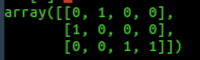

# SPATIAL PYRAMID FEATURES

Python implementation of the [spatial pyramid features](https://ieeexplore.ieee.org/document/1641019) used on [2013 Label Consistent K-SVD: Learning a Discriminative Dictionary for Recognition](https://ieeexplore.ieee.org/abstract/document/6516503).


## INSTALLATION


1. Create virtual environment (recommended) and activate it

2. Install all the dependencies

	```bash
	pip install -r requirements
	```
3. Create the datasets directory

	```bash
	mkdir datasets_dir
	```

4.  Copy or create a symbolink link to your dataset. e.g.:

	``` bash
	cd datasets_dir
	ln -s <your path>/patchcamelyon/ patchcamelyon
	```
	The app used to create the dataset was [this one](https://github.com/giussepi/BACH_ICIAR_2018).
	However, the important thing to keep in mind is that the app works with numpy arrays. We saved
	our dataset as JSON files so you can take a look at the loader [here](https://github.com/giussepi/spatial-pyramid-features/blob/master/utils/datasets/handlers.py). About the format of the arrays:

	1. You must provide a training and testing JSON files. These files must contain a JSON serialized python dictionary with to keys: 'codes' and 'labels'.

	2. When turning the 'codes' values to a 2D numpy array, this array must have the shape `(num features, num samples)`. Thus, the each column must refer to a sample.

		``` python
			# OPTION 1: Full datastet to be loaded in memory
  			'codes': [[values_row_1], [values_row_2], [values_row_3], ...]

			# The easiest way to create this option using numpy is:
			'codes': [[mydata[i].tolist() for i in range(mydata.shape[0])] ]

			# OPTION 2: Images paths (memory efficient)
			'codes': ['img_path_1', 'img_path_2', 'img_path_3', ...]
		```

		For the OPTION 1 you can get some inspiration/clarification by looking at the class [BaseDatasetCreator](https://github.com/giussepi/BACH_ICIAR_2018/blob/master/utils/datasets/bach.py) and its derivates RawImages and RandomFaces. Specifically, look for the methods: 'process_data, format_for_LC_KSVD, create_datasets_for_LC_KSVD'.

	3. For the labels (must be integers) you also have two options:
		1. The labels must be represented by the rows and the columns must represent the number of samples. For instance, in the following image we can see a tiny label matrix of three labels
		and four samples:

	       

		2. The labels can be a 1D array, holding the values of the labels, e.g.: The follwing array is the 1D representation of the labels example presented previously.

	       ``` python
			   [1, 0, 2, 2]
		   ```

5. Copy the settings template and configure it properly.

	``` bash
	cp settings.py.template settings.py
	```

## Important notes
If the image dataset does not have the grey-scale PIL format ('L', ), then each sample will be automatically converted (in memory) before any processing. This behaviour is defined at:

    `utils/datasets/items.py -> LazyDatasetItems.get_sample`

## Usage

### Create spatial pyramid features
``` python
from core.feature_extractors import SpatialPyramidFeatures
from utils.datasets.handlers import InMemoryDBHandler, LazyDBHandler

# For datasets completely contained in json files
spf = SpatialPyramidFeatures(InMemoryDBHandler)
# For datasets holding just paths to images in the JSON files
spf = SpatialPyramidFeatures(LazyDBHandler)
#
spf.create_codebook()
spf.create_spatial_pyramid_features()
```

### Load all train/test datasets in memory

The JSON files must already contain all the image values/features

```python
from utils.datasets.handlers import InMemoryDBHandler, LazyDBHandler

train_feats, train_labels, test_feats, test_labels = InMemoryDBHandler()()
```

### Load only image paths and access to them only when necessary

The JSON files must have paths to the images

```python
from utils.datasets.handlers import InMemoryDBHandler, LazyDBHandler

train_feats, train_labels, test_feats, test_labels = LazyDBHandler()()
```

### Load spatial pyramid features

``` python
from utils.datasets.handlers import FeatsHandler

train_feats, train_labels, test_feats, test_labels = FeatsHandler()()
```

### Create a subset of the spatial pyramid features dataset and load it
``` python

from utils.datasets.handlers import FeatsHandler

FeatsHandler().create_subsets(percentage=20, verbose=True)
train_feats, train_labels, test_feats, test_labels = FeatsHandler(percentage=20, verbose=True)()
```
